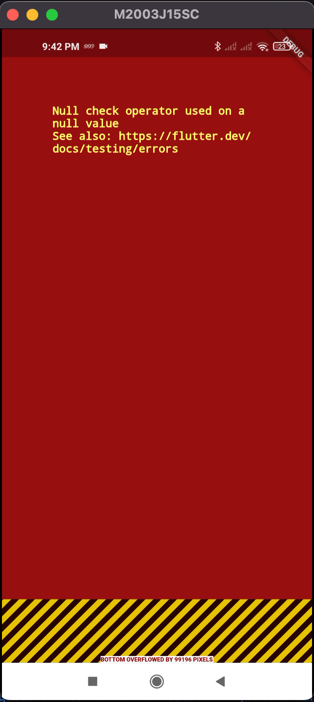
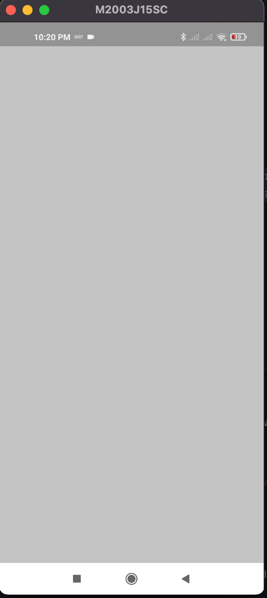
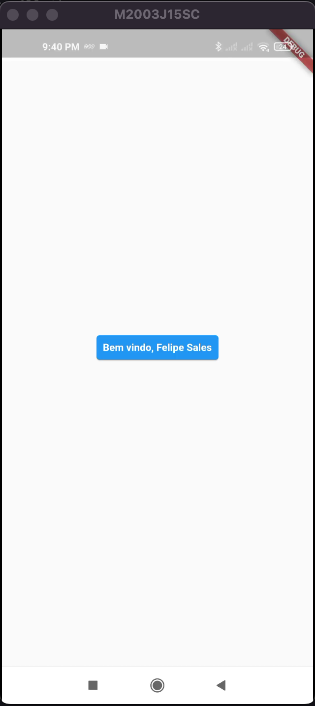
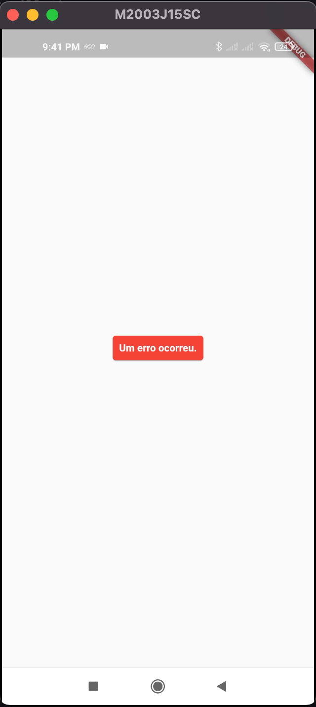

# Flutter Error Page

### I'm sure you've seen this!

Do you know how to customize this error screen?

🐛 Debug Mode | 📱 Release Mode
:-------------------------:|:-------------------------:
 | 

---

You have certainly come across this red screen while developing applications, and you should also know that in release mode it turns grey.

Can you imagine your users seeing this unfriendly screen? 

**There is the solution for this, and I'll show you.**

---

### How to make

When an error occurs, the `ErrorWidget.builder` is called; and by default the behaviour is what we already know.

But we can customize this, returning a widget of our own.

```dart
return MaterialApp(
  title: 'Flutter Error Page',
  home: const MyHomePage(),
  builder: (context, widget) {
    ErrorWidget.builder = (FlutterErrorDetails errorDetails) {
      return CustomError(errorDetails: errorDetails); // the custom widget
    };

    return widget ?? const SizedBox.shrink();
  },
);
```

Just return it in this callback.

And on it, you can do absolutely whatever you want (remember to consider the *constraints*, available space, e.g) - happen at the most unexpected moment. 😆

```dart
return const MyAppCard(
  color: Colors.red,
  text: 'Um erro ocorreu.',
);
```

---

### How will it be

Expected | Default Error | Release Error | Debug and/or Release with custom widget
:-------------------------:|:-------------------------:|:-------------------------:|:-------------------------:
 |  |  | 

--- 

> So, did you know this strategy? 
> 
> Star ⭐️ this project if you liked it, and share it! 🚀
